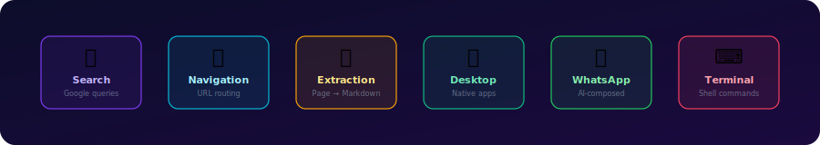
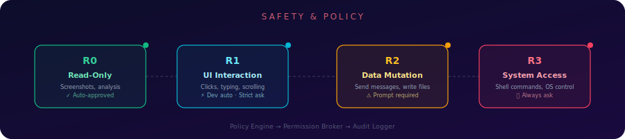

<p align="center">
  
</p>

<p align="center">
  <a href="#-quick-start"></a>
  <a href="#-architecture"></a>
  <a href="#-skills"></a>
  <a href="#-safety"></a>
</p>

<p align="center">
  
  
  
  
  
  
</p>

<br/>

> **Ultragravity** is an autonomous AI agent for macOS that **sees your screen**, **understands your intent**, and **acts like a human** — browsing the web, controlling native apps, sending messages, and executing multi-step tasks from a single natural-language prompt.

<br/>

<p align="center">
  
</p>

<br/>

## ✨ What Can It Do?

<table>
<tr>
<td width="50%" valign="top">

### 🌐 Web Automation
```bash
./run.sh "Search for the latest news about AI agents"
./run.sh "Go to github.com and star the repo"
./run.sh "Find flights from NYC to London next week"
```

### 💬 WhatsApp Messaging
```bash
./run.sh "Send a greeting to Ayush Benny"
./run.sh "Message Ayush asking about fynqAI progress"
./run.sh "Write a message to Ayush about tomorrow's meeting"
```
> The AI **composes** a natural, friendly message — it doesn't copy-paste your prompt!

</td>
<td width="50%" valign="top">

### 🖥️ Desktop Control
```bash
./run.sh "Open Calculator and compute 847 * 23"
./run.sh "Write a note about my meeting at 2pm"
./run.sh "Open Safari and go to apple.com"
```

### 🧠 Smart Research
```bash
./run.sh "Research quantum computing breakthroughs in 2025"
./run.sh "Summarize the Wikipedia article on black holes"
./run.sh "Find the best restaurants in Kochi"
```

</td>
</tr>
</table>

<br/>

<p align="center">
  
</p>

<br/>

## 🚀 Quick Start

### Prerequisites

- **macOS** Sonoma or later
- **Python** 3.11+ (3.14 works, avoid building C extensions)
- **API Keys**: [Google Gemini](https://aistudio.google.com/apikey) and/or [Mistral](https://console.mistral.ai/api-keys)

### Installation

```bash
# 1. Clone the repo
git clone https://github.com/your-org/ultragravity.git
cd ultragravity

# 2. Create virtual environment
python3.11 -m venv .venv
source .venv/bin/activate

# 3. Install dependencies
pip install -r requirements.txt

# 4. Install browser (for web automation)
playwright install chromium

# 5. Set up your API keys
cp .env.example .env   # then edit with your keys
```

### Configure API Keys

Create a `.env` file in the project root:

```env
GEMINI_API_KEY=your_gemini_api_key_here
MISTRAL_API_KEY=your_mistral_api_key_here
BROWSER_HEADLESS=false
LOG_LEVEL=INFO
```

### First Run

```bash
# Make the launcher executable
chmod +x run.sh

# Try it!
./run.sh "Write a note about buying groceries"
```

### macOS Permissions

Ultragravity needs these System Settings permissions:

| Permission | Why | Where to Enable |
|-----------|-----|-----------------|
| **Accessibility** | Mouse/keyboard automation | Privacy & Security → Accessibility |
| **Screen Recording** | Desktop screenshots | Privacy & Security → Screen Recording |
| **Automation** | AppleScript app control | Privacy & Security → Automation |

> 💡 **Tip:** Run `ultragravity ask --wizard` for an interactive setup guide that walks you through everything.

<br/>

<p align="center">
  
</p>

<br/>

## 🏗 Architecture

<p align="center">
  
</p>

Ultragravity has two execution paths:

### ⚡ Quick Path (< 2 seconds)
For simple, well-understood tasks (WhatsApp messages, Notes), the CLI **bypasses the full agent** entirely. No browser launch, no VLM calls — just direct AppleScript execution with optional LLM message composition.

```
Prompt → Parser → Contact Map → LLM Compose → AppleScript → Done ✅
```

### 🧠 Full Agent Path
For complex, multi-step tasks that require seeing the screen:

```
Prompt → Planner → [Screenshot → VLM → Action → Execute] × N → Done ✅
```

<br/>

### 👁 Vision AI Loop

<p align="center">
  
</p>

The core intelligence loop:

1. **📸 Screenshot** — Capture the current screen state (via `mss` for desktop, Playwright for browser)
2. **🧠 LLM Analyze** — Send the screenshot + instruction to Gemini 2.5 Flash (or Mistral fallback) for multimodal analysis
3. **🎯 Plan Action** — LLM returns a structured JSON action: `click(x,y)`, `type(text)`, `scroll(direction)`, `wait`, or `done`
4. **⚡ Execute** — Perform the action with human-like mouse curves (Bézier paths) and natural typing delays
5. **🔄 Repeat** — Loop until the LLM signals `done` or max iterations reached

#### Cost Optimization

The vision loop is expensive (each screenshot = 1 LLM call). Ultragravity minimizes cost with:

| Technique | How It Works |
|-----------|-------------|
| **State Change Detection** | dHash compares consecutive screenshots — if nothing changed, skip the LLM call |
| **Deterministic Router** | Known patterns (cookie banners, login forms) are handled without LLM |
| **TTL Caches** | Vision results, summaries, and tool outputs are cached with configurable TTL |
| **Skill Fast-Paths** | High-confidence intent matches (search, navigation) bypass the vision loop entirely |
| **Budget Manager** | Per-provider RPM/TPM/daily limits with soft caps prevent runaway costs |

<br/>

<p align="center">
  
</p>

<br/>

## 🎯 Skills

<p align="center">
  
</p>

Skills are **fast-path handlers** that match specific intents with high confidence and execute directly, bypassing the full VLM loop.

| Skill | Triggers | What It Does |
|-------|----------|-------------|
| 🔍 **Search** | "search for", "find", "look up" | Rewrites query, navigates to Google, submits |
| 🧭 **Navigation** | "go to", URLs in text | Direct browser navigation |
| 📄 **Extraction** | "summarize", "extract", "read" | Strips page clutter, extracts clean markdown |
| 🖥️ **Desktop** | "open Calculator", "open Notes" | Launches native macOS apps, handles Calculator math |
| 💬 **WhatsApp** | "send", "message", "text", names | AI-composes message, sends via URL scheme |
| ⌨️ **Terminal** | Shell commands (via gateway) | Sandboxed command execution with R3 safety |

### How Skill Routing Works

```python
# Each skill scores its confidence (0.0 – 1.0)
search_skill.can_handle("search for AI news")     # → 0.95  ✅ handles it
whatsapp_skill.can_handle("message Ayush hello")   # → 0.97  ✅ handles it  
desktop_skill.can_handle("what is the weather")    # → 0.10  ❌ falls through to VLM
```

When confidence ≥ 0.8, the skill executes directly. Otherwise, the full vision loop takes over.

### Adding Custom Skills

```python
from skills.base import Skill

class MyCustomSkill(Skill):
    def can_handle(self, instruction: str) -> float:
        if "my trigger" in instruction.lower():
            return 0.95
        return 0.0

    def execute(self, params: dict) -> dict:
        # Your logic here
        return {"status": "success", "result": "done"}
```

Register it in `agent/core.py`:
```python
self.skills = [MyCustomSkill(self), ...]
```

<br/>

<p align="center">
  
</p>

<br/>

## 💬 WhatsApp Integration

Ultragravity can send WhatsApp messages through the **native macOS app** — no web browser needed.

### How It Works

```
"Message Ayush about the standup tomorrow"
         │
         ▼
   ┌─────────────┐
   │ Parse Intent │──→ contact: "Ayush Benny"
   │              │──→ intent: "about the standup tomorrow"  
   └──────┬──────┘
          │
          ▼
   ┌─────────────┐
   │ Contact Map  │──→ phone: "+91 86063 XXXXX"
   └──────┬──────┘
          │
          ▼
   ┌─────────────┐
   │ LLM Compose  │──→ "Hey Ayush, just a reminder about 
   │  (Mistral)   │    the standup tomorrow! Don't forget 😊"
   └──────┬──────┘
          │
          ▼
   ┌─────────────┐
   │  URL Scheme  │──→ whatsapp://send?phone=...&text=...
   └──────┬──────┘
          │
          ▼
       ✅ Sent!
```

### Adding Contacts

Edit `skills/contact_map.py`:

```python
WHATSAPP_CONTACT_MAP: dict[str, str] = {
    "ayush benny": "+91 86063 XXXXX",
    "john doe":    "+1 555 123 4567",
    "mom":         "+91 98765 43210",  # shorthand works!
}
```

> **Shorthand matching**: Saying "message Ayush" matches "ayush benny" automatically.

### Message Intelligence

The AI **composes** natural messages — it never sends your raw prompt:

| Your Prompt | What Gets Sent |
|------------|---------------|
| "send a greeting to Ayush" | "Hey Ayush! Hope you're doing great 😊" |
| "message Ayush about the standup tomorrow" | "Hey Ayush, quick reminder about the standup tomorrow. See you there!" |
| "ask Ayush about fynqAI progress" | "Hey Ayush, how's the fynqAI development going? Any updates?" |
| "send hi to Ayush" | "hi" *(simple messages go through as-is)* |

<br/>

<p align="center">
  
</p>

<br/>

## 🛡 Safety

<p align="center">
  
</p>

Every action flows through a **three-layer safety pipeline**:

```
Action → PolicyEngine → PermissionBroker → AuditLogger
```

### Policy Profiles

| Profile | R0 (Read) | R1 (UI) | R2 (Mutate) | R3 (System) |
|---------|-----------|---------|-------------|-------------|
| 🔒 **Strict** | ✅ Auto | ⚠️ Ask | ⚠️ Ask | 🛡 Ask |
| ⚡ **Balanced** | ✅ Auto | ⚠️ Ask | ⚠️ Ask | 🛡 Ask |
| 🔧 **Developer** | ✅ Auto | ✅ Auto | ⚠️ Ask | 🛡 Ask |

```bash
# View current policy
ultragravity policy

# Switch profiles
ultragravity policy --set strict
ultragravity policy --set developer
```

### Audit Trail

All actions are logged to `logs/audit/actions-YYYYMMDD.jsonl`:

```json
{
  "timestamp": "2026-02-16T12:35:00Z",
  "action": "whatsapp_send",
  "risk_level": "R2",
  "decision": "approved",
  "target": "+91 86063 XXXXX",
  "message": "Hey Ayush! Hope you're doing great 😊"
}
```

### Permission Prompt

When an action requires approval, you'll see:

```
┌──────────────────────────────────────────────┐
│  🛡  Action requires approval                │
│                                              │
│  Action:  whatsapp_send_message              │
│  Risk:    R2 (Data Mutation)                 │
│  Target:  Ayush Benny (+91 86063 XXXXX)      │
│  Message: "Hey Ayush, how's fynqAI going?"   │
│                                              │
│  [1] Approve once                            │
│  [2] Approve for session                     │
│  [3] Deny                                    │
│  [4] Abort                                   │
└──────────────────────────────────────────────┘
```

<br/>

<p align="center">
  
</p>

<br/>

## 🤖 Human Simulation

Ultragravity doesn't just click buttons — it **moves like a human** to evade bot detection:

### 🖱️ Mouse Movement
- **Bézier curve paths** with randomized control points
- **Ease-in/ease-out** acceleration profiles
- **Micro-jitter** for natural imprecision
- Human-like click delay (50–150ms)

### ⌨️ Typing
- **120–300 CPM** (characters per minute) — matches human range
- **15% chance** of longer pauses between keystrokes
- Natural rhythm variation per character

### 👁 Vision
- **Retina/HiDPI scaling** — coordinates are automatically adjusted
- **Screenshot comparison** — dHash diffing to detect state changes
- **Hierarchical summarization** — long pages are chunked → summarized → merged

<br/>

<p align="center">
  
</p>

<br/>

## ⚙️ Configuration

All settings live in `ultragravity.config.yaml`:

```yaml
app:
  log_level: INFO
  model_name: gemini-2.5-flash     # Primary VLM
  headless: false                   # Show browser window

security:
  require_env_file: true
  fail_if_no_provider_key: true

provider:
  gemini:
    rpm_limit: 10                   # Requests per minute
    tpm_limit: 12000                # Tokens per minute
    daily_request_limit: 500
    soft_cap_ratio: 0.6             # Warn at 60% usage
  mistral:
    rpm_limit: 8
    tpm_limit: 10000
    daily_request_limit: 400
  scheduler:
    max_retries: 3
    base_backoff: 2.0               # Seconds
    max_backoff: 20.0
    jitter: 0.4

call_reduction:
  state_change_threshold: 5        # dHash diff threshold
  vision_cache_ttl: 30             # Seconds
  summary_cache_ttl: 120
  tool_cache_ttl: 60

planner:
  max_iterations: 20               # Max vision loop cycles
  retry_attempts: 2

memory:
  backend: sqlite
  sqlite_path: data/ultragravity_memory.db
  max_events: 5000
  retrieval_top_k: 5               # Facts to retrieve per query
```

<br/>

<p align="center">
  
</p>

<br/>

## 🧠 Memory System

Ultragravity has **persistent memory** powered by SQLite:

```
┌─────────────────────────────────────────┐
│              Memory Manager             │
├──────────┬──────────┬───────────────────┤
│  Events  │  Prefs   │  Exec Snapshots   │
│ (facts)  │ (user)   │  (task state)     │
├──────────┴──────────┴───────────────────┤
│           SQLite Repository             │
│     data/ultragravity_memory.db         │
└─────────────────────────────────────────┘
```

- **Events** — facts learned during tasks ("Ayush is working on fynqAI")
- **Preferences** — user preferences persisted across sessions
- **Execution Snapshots** — task state for resumption after interrupts
- **Goal Augmentation** — relevant past facts are injected into new task prompts

<br/>

<p align="center">
  
</p>

<br/>

## 📁 Project Structure

```
ultragravity/
├── 🚀 run.sh                    # One-line launcher
├── 📋 main.py                   # Legacy entrypoint
├── 📦 requirements.txt          # Python dependencies
├── ⚙️ ultragravity.config.yaml  # Runtime configuration
├── 🔑 .env                      # API keys (git-ignored)
│
├── 🤖 agent/                    # Core agent layer
│   ├── core.py                  # Main orchestrator & goal loop
│   ├── vision.py                # Multimodal VLM (Gemini/Mistral)
│   ├── browser.py               # Playwright browser automation
│   ├── desktop.py               # macOS desktop automation
│   ├── humanizer.py             # Bézier mouse & natural typing
│   └── bridge_applescript.py    # AppleScript bridge
│
├── 🎯 skills/                   # Fast-path skill handlers
│   ├── base.py                  # Abstract Skill base class
│   ├── search.py                # Google search skill
│   ├── navigation.py            # URL navigation skill
│   ├── extraction.py            # Page content extraction
│   ├── desktop_control.py       # Native app launcher
│   ├── whatsapp.py              # WhatsApp messaging skill
│   └── contact_map.py           # Name → phone mapping
│
├── 📦 ultragravity/             # Core runtime package
│   ├── cli.py                   # CLI entrypoint & routing
│   ├── config.py                # Pydantic config models
│   ├── actions.py               # Action & risk level models
│   ├── policy.py                # Safety policy engine
│   ├── permissions.py           # Interactive permission broker
│   ├── gateway.py               # Central action gateway
│   ├── audit.py                 # JSONL audit logger
│   ├── planner.py               # Task planner
│   ├── executor.py              # Plan step executor
│   ├── state_machine.py         # Session state machine
│   ├── budget.py                # Per-provider budget limits
│   ├── scheduler.py             # LLM call scheduler + retries
│   ├── telemetry.py             # Usage metrics logger
│   ├── call_reduction.py        # Cost optimization (caches, dedup)
│   ├── context_shaper.py        # Context windowing & summarization
│   ├── prompt_library.py        # Structured LLM prompts
│   └── memory/                  # Persistent memory subsystem
│       ├── models.py            #   Data models
│       ├── repository.py        #   Abstract repository
│       ├── sqlite_repository.py #   SQLite implementation
│       └── manager.py           #   High-level memory API
│
├── 🔧 tools/                    # Tool abstraction layer
│   └── terminal.py              # Shell command execution
│
├── 📊 logs/                     # Runtime logs
│   ├── audit/                   #   Action audit trail
│   └── telemetry/               #   Provider usage metrics
│
└── 📁 data/                     # Persistent data
    ├── ultragravity_memory.db   #   SQLite memory store
    └── setup_state.json         #   First-run wizard state
```

<br/>

<p align="center">
  
</p>

<br/>

## 🖥️ CLI Reference

```bash
# ── Run with instruction ─────────────────────────────────
./run.sh "your instruction here"

# ── Full agent with starting URL ──────────────────────────
ultragravity run "summarize this page" --url https://example.com

# ── Quick tasks (auto-detected) ───────────────────────────
ultragravity ask "send a message to Ayush about the meeting"
ultragravity ask "write a note about groceries"

# ── Safety & policy ──────────────────────────────────────
ultragravity policy                    # View current profile
ultragravity policy --set developer    # Switch to developer mode

# ── Observability ────────────────────────────────────────
ultragravity logs                      # View recent logs
ultragravity logs --kind audit         # Audit trail only
ultragravity logs --kind telemetry     # API usage only
ultragravity status                    # Budget, approvals, health

# ── Setup wizard ─────────────────────────────────────────
ultragravity ask --wizard "your task"  # Interactive first-run guide
```

### Environment Variables

| Variable | Required | Description |
|----------|----------|-------------|
| `GEMINI_API_KEY` | Yes* | Google Gemini API key |
| `MISTRAL_API_KEY` | Yes* | Mistral API key (fallback/message composition) |
| `BROWSER_HEADLESS` | No | `true` to hide browser window |
| `LOG_LEVEL` | No | `DEBUG`, `INFO`, `WARNING`, `ERROR` |
| `ULTRAGRAVITY_CONFIG_PATH` | No | Custom config file path |

> \*At least one API key is required.

<br/>

<p align="center">
  
</p>

<br/>

## 🧪 Testing

```bash
# Run all tests
python -m pytest tests/ -v

# Run specific test
python -m pytest test_desktop_notes.py -v

# Run with coverage
python -m pytest tests/ --cov=ultragravity --cov=agent --cov=skills -v
```

<br/>

<p align="center">
  
</p>

<br/>

## 🗺️ Roadmap

- [x] 🧠 Vision-first autonomous agent loop
- [x] 🌐 Browser automation with stealth
- [x] 🖥️ macOS desktop control  
- [x] 💬 WhatsApp native app integration
- [x] 🤖 AI message composition (Mistral)
- [x] 🛡 Safety pipeline (policy → permissions → audit)
- [x] 💾 Persistent memory (SQLite)
- [x] 💰 Cost optimization (caching, dedup, budget)
- [ ] 📱 iOS Shortcuts integration
- [ ] 🎙️ Voice input mode
- [ ] 📧 Email integration (Apple Mail)
- [ ] 📅 Calendar automation
- [ ] 🔗 Multi-agent task delegation
- [ ] 🐧 Linux desktop support

<br/>

<p align="center">
  
</p>

<br/>

## 📄 Dependencies

| Package | Version | Purpose |
|---------|---------|---------|
| `playwright` | 1.50+ | Browser automation engine |
| `playwright-stealth` | latest | Anti-detection patches |
| `google-generativeai` | latest | Gemini multimodal API |
| `mistralai` | latest | Mistral API client |
| `python-dotenv` | latest | `.env` file loading |
| `pydantic` | 2.x | Configuration validation |
| `PyYAML` | latest | YAML config parsing |
| `numpy` | latest | Numerical operations |
| `Pillow` | latest | Image processing & dHash |
| `pyautogui` | latest | Desktop mouse/keyboard |
| `mss` | latest | Fast screenshot capture |
| `pynput` | latest | Input monitoring |
| `termcolor` | latest | Colored terminal output |
| `certifi` | latest | SSL certificates (macOS) |

<br/>

<p align="center">
  
</p>

<p align="center">
  <sub>
    <b>Ultragravity</b> — Because your computer should work for you, not the other way around.
  </sub>
</p>
# ultragravity
